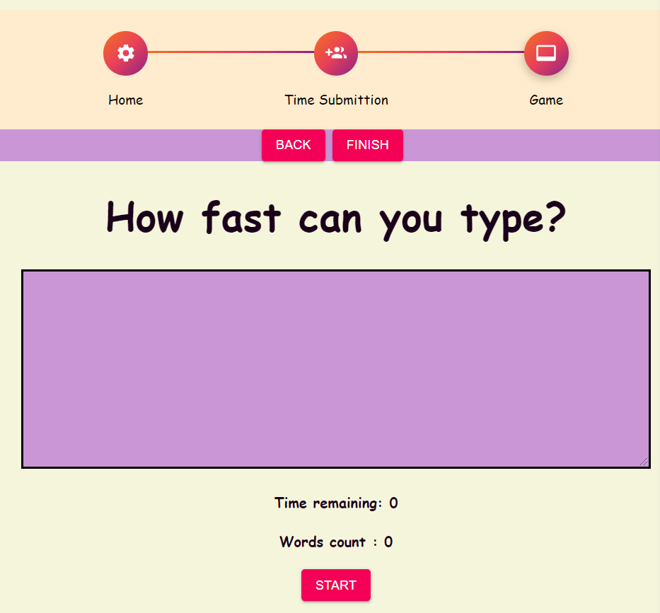

# How Fast Can You Type?

## The Typing Game

>  Have you ever wondered how fast can you type?
>  Now, you can check it with real time measurements.
>  **The Typing Game** provides you an opportunity to choose your own 
>  challenge, and test yourself.

## How Does It Work?

To begin your challenge, you need to go through the "Time Submittion" page.
Use "Next" and "Back" buttons to navigate through the app.

Once you are asked to submit your time, enter you choice (in seconds) and press "Submit".

To start the game, use "Next" to go to the "Game" page.
Good Luck!


## How Does It Looks Like?


## 

## 

## 

## Technology Wise

This mini-project was created on client-site, using `React`. 
The components are purely functional components.

> - React hooks (useState, useEffect, useRef)
> - React customize hooks (useWordGame)
> - React PropTypes
> - `react-router` - Routing 
> - `React Redux` -  Maintaining global state between components
> - ES6 logic
> - Material-UI (makeStyles, withStyles, useStyles)

## Running On Your Local Machine

Feel free to get a copy of the project and run it on your local machine.
Here are some instructions:

### Prerequisites
Packages :
* `npm`
* `react`
* `react-dom`
* `react-router-dom`
* `react- redux`
* `redux`

### Installing
```
npm install npm@latest -g

npm install react

npm install react-dom

npm install react-router

npm install react-redux

npm install redux


```
